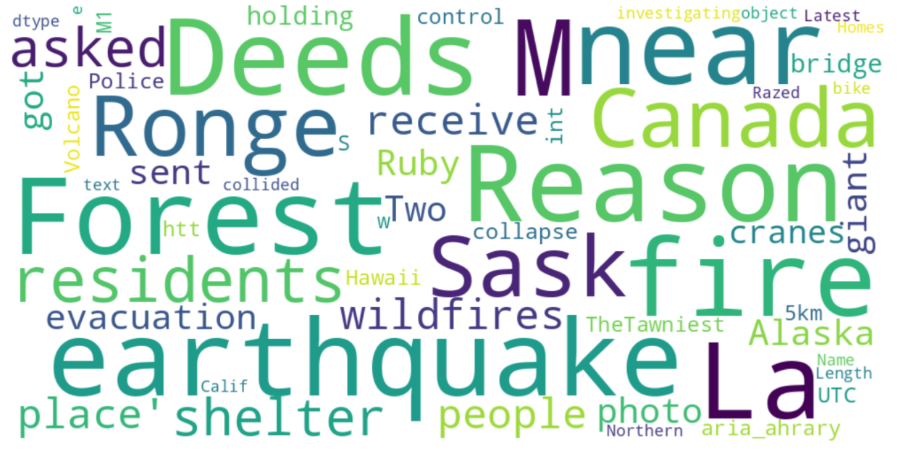
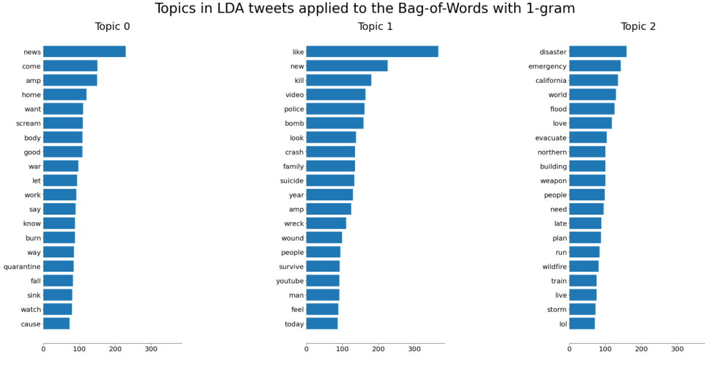
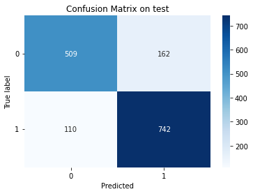

The goal of this project is to show the Natural Language Processing applications in Insurance by disaster tweets data set from Kaggle. https://www.kaggle.com/c/nlp-getting-started 

Topics showed are:

### Exploratory Data Analysis:
  
    -Language detection;
  
    -Lenght analysis;
  
    -Wordcloud

### Text Analysis:
  
    -Text cleaning;
  
    -Named Entity Recognition;
  
    -N-grams;
  
    -Topic Modelling;
  
    -Word embedding;
 
### Text Classification:
  
    -Classification with BERT
  

